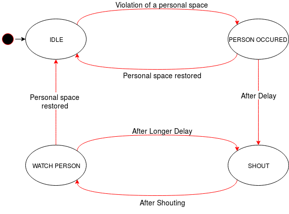

# Shy Roboy
#### Always respect personal space!
HackRoboy Spring 2019 project. Roboy avoids contact with people and tells them to leave.
If they don't respect personal space, it even calls the police!

* __Presentation__: https://docs.google.com/presentation/d/1sepASApQEQojkrxxHL5WlevOjM1tnba5YooexWaJY78
* __Video__: https://youtu.be/h9a69p3XACQ

# ROS topics
List of ROS topics that we publish.

Topic | Data Type | Description
--- | :---: | ---
`shy_roboy/nearest_distance`|Float32|Average value of the closest points to camera which are closer than threshold (in meters).
`shy_roboy/state`|Int8|__IDLE:__ 0 __OCCURED:__ 1 __SHOUT:__ 2 __WATCH:__ 3

# Program States

# ROS Nodes
Script Name | Publishes | Subscribes | Description
--- | :---: | :---: | ---
`getCamImg.py`|`/shy_roboy/nearest_distance` (Float32)|`/zed/zed_node/depth/depth_registered` (Image)|Reads depth image from ZED camera, applies threshold and calculates the average of the closest pixels.
`filtering.py`|`/shy_roboy/state` (Int8)|`/shy_roboy/nearest_distance` (Float32)|Changes the state of program using the state machine above.
`callLeds.py`|`/roboy/control/matrix/leds/mode/simple` (Int32)|`/shy_roboy/state` (Int8)|Listens state and decides to change Roboy's LEDs accordingly.
`callEmotions.py`|-|`/shy_roboy/state` (Int8)|Listens state and changes Roboy's emotion to angry via `/roboy/cognition/face/emotion` service call.
`move_head.py`|`/sphere_head_axis0/sphere_head_axis0/target` (Float32)|`/shy_roboy/nearest_distance` (Float32)|Listens `/shy_roboy/nearest_distance` and calculates head movement angle in radians.
`shouter.py`|-|`/shy_roboy/state` (Int8)|Executes shouting task via `/roboy/cognition/speech/synthesis/talk` service call.

# Members

- [Bilal Vural](https://github.com/bilalvur)
- [Ruofan Xu](https://github.com/rfn123)
- [Stanislav Lukyanenko](https://github.com/stlukyanenko)
- [Arne Sachtler](https://github.com/aaarne)